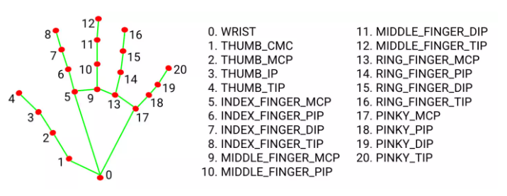

# 期末專題

## 桌面型手部辨識滑鼠

## 組員

> S0954001 龔品宇 \
S0954005 林昀佑 \
S0954022 林煜宸 \
S0954040 吳季旻 \
S0xxxxxx 許家碩

## 流程

1. 透過影像輸入設備取得桌面手部影像 \
分辨出手部與桌面
2. 找出手部之後 \
將手部位置定為原點
3. 將目前偵測到的手部做骨架應用
4. 分別將骨架的各模式偵測出來 \
並根據各個功能去做操作
    * 左右移動 (對應滑鼠X軸)(許家碩)
    * 前後移動 (對應滑鼠Y軸)(林煜宸)
    * 左鍵press(林昀佑)
    * 左鍵release(林昀佑)
    * 右鍵press(吳季旻)
    * 右鍵release(吳季旻)
    * 側鍵press(龔品宇)
    * 側鍵release(龔品宇)

> 參考連結 \
<https://blog.gtwang.org/programming/opencv-webcam-video-capture-and-file-write-tutorial/> \
<https://ithelp.ithome.com.tw/articles/10265041>
<https://medium.com/%E9%9B%9E%E9%9B%9E%E8%88%87%E5%85%94%E5%85%94%E7%9A%84%E5%B7%A5%E7%A8%8B%E4%B8%96%E7%95%8C/%E6%A9%9F%E5%99%A8%E5%AD%B8%E7%BF%92-ml-note-yolo-%E5%88%A9%E7%94%A8%E5%BD%B1%E5%83%8F%E8%BE%A8%E8%AD%98%E5%81%9A%E7%89%A9%E4%BB%B6%E5%81%B5%E6%B8%AC-object-detection-%E7%9A%84%E6%8A%80%E8%A1%93-3ad34a4cac70>
